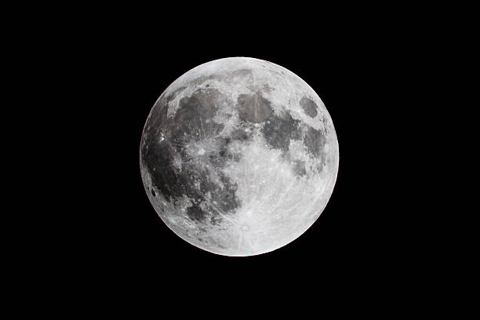

# Lunar Surface Composition Predictor

**"The moon is the first milestone on the road to the stars." - Arthur C. Clarke**

## First of all, why should I care?
Mining is one of the most polluting industries in the world. In 2017, metals mines generated nearly 2 billion pounds of toxic waste. On the other hand, our daily lives depend heavily on the consistent and affordable delivery of a varity of metals that are mined all over the world. Lithium and Cobalt, two major components of modern lithium-ion batteries that powers everything from EVs to smartphones, have some of the highest environmental impact within the mining industry. Their supplies are also fairly limited on Earth, experts suggest we may run out of lithium before EVs can take over the road. 

**TO BE CONTINUED...**

## Video Demo
